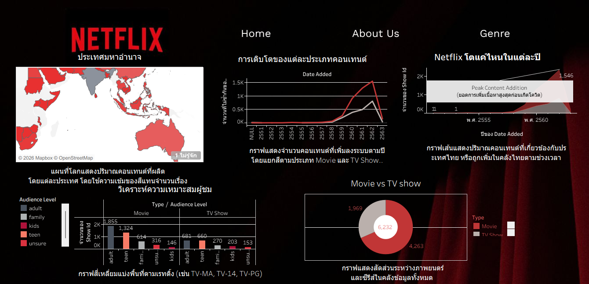
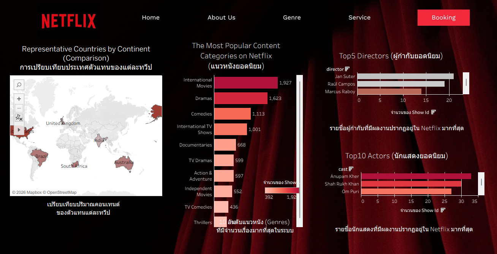

# Netflix Content Analysis Dashboard

**Data Analysis & Visualization Project | Tableau · Tableau Public · Data Visualization · Dashboard**

## Project Overview

โปรเจกต์นี้เป็นการวิเคราะห์และนำเสนอข้อมูลคอนเทนต์ของ Netflix ผ่าน Interactive Dashboard ด้วย Tableau

Dashboard ถูกออกแบบเพื่อช่วยสำรวจภาพรวมของคอนเทนต์บน Netflix ทั้งภาพยนตร์และรายการโทรทัศน์ รวมถึงวิเคราะห์ประเภทคอนเทนต์ ประเทศที่ผลิต แนวหนัง กลุ่มผู้ชม นักแสดง ผู้กำกับ และแนวโน้มการเพิ่มคอนเทนต์ในแต่ละช่วงเวลา

ผลการวิเคราะห์ถูกนำเสนอผ่านกราฟ แผนที่ และ Dashboard เพื่อช่วยให้สามารถเปรียบเทียบและทำความเข้าใจข้อมูลได้ง่ายขึ้น

## Live Interactive Dashboard

สามารถทดลองใช้งาน Interactive Dashboard ได้ผ่าน Tableau Public

[View Interactive Dashboard on Tableau Public](https://public.tableau.com/views/NetflixContentAnalysisDashboard_17871701191730/ContentAnalysis?:language=th-TH&publish=yes&:sid=&:redirect=auth&:display_count=n&:origin=viz_share_link)

## Dashboard Overview

Dashboard ประกอบด้วย 2 หน้าหลักสำหรับสำรวจและวิเคราะห์ข้อมูล Netflix

### 1. Content Overview

แสดงภาพรวมของข้อมูลคอนเทนต์ Netflix เช่น

- การกระจายของคอนเทนต์ตามประเทศ
- แนวโน้มการเพิ่มคอนเทนต์ในแต่ละช่วงเวลา
- การเปรียบเทียบ Movie และ TV Show
- การวิเคราะห์ระดับผู้ชม (Audience Level)

<p align="center">
  
</p>

### 2. Content Analysis

วิเคราะห์รายละเอียดของคอนเทนต์เพิ่มเติม เช่น

- ประเทศตัวแทนในแต่ละทวีป
- หมวดหมู่คอนเทนต์ยอดนิยม
- แนวหนังที่มีจำนวนคอนเทนต์สูง
- ผู้กำกับที่มีผลงานปรากฏในข้อมูลมากที่สุด
- นักแสดงที่มีผลงานปรากฏในข้อมูลมากที่สุด
- การเปรียบเทียบข้อมูลในแต่ละกลุ่ม

<p align="center">
  
</p>

## Analysis Areas

- Content Type Analysis
- Genre Analysis
- Country Analysis
- Audience Rating Analysis
- Actor Analysis
- Director Analysis
- Content Trend Analysis
- Movie vs TV Show Comparison

## Dashboard Features

- Interactive Data Visualization
- Geographic Analysis ด้วยแผนที่
- การเปรียบเทียบ Movie และ TV Show
- การจัดอันดับ Genre, Actor และ Director
- การวิเคราะห์แนวโน้มของคอนเทนต์ตามช่วงเวลา
- การนำเสนอข้อมูลผ่านกราฟหลายรูปแบบ
- Interactive Dashboard สำหรับสำรวจข้อมูล

## Data Visualization

เลือกใช้ Visualization ให้เหมาะสมกับข้อมูลแต่ละประเภท เช่น

- **Map** — แสดงการกระจายของคอนเทนต์ตามประเทศ
- **Line Chart** — วิเคราะห์แนวโน้มของข้อมูลตามช่วงเวลา
- **Bar Chart** — เปรียบเทียบและจัดอันดับข้อมูล
- **Donut Chart** — เปรียบเทียบสัดส่วน Movie และ TV Show

## Tools & Technologies

- Tableau Public
- Tableau Desktop Public Edition
- Data Visualization
- Dashboard Design
- Data Analysis

## My Responsibilities

- เตรียมและนำข้อมูลเข้าสู่ Tableau
- วิเคราะห์ข้อมูล Netflix ในมิติต่าง ๆ
- เลือกประเภทกราฟให้เหมาะสมกับข้อมูล
- สร้าง Worksheets สำหรับการวิเคราะห์
- ออกแบบและพัฒนา Interactive Dashboard
- สร้าง Visualization สำหรับเปรียบเทียบข้อมูล
- จัดองค์ประกอบ Dashboard เพื่อสื่อสารผลการวิเคราะห์
- Publish Dashboard ผ่าน Tableau Public

## Project Files

```text
netflix-content-analysis-tableau/
│
├── README.md
├── Netflix Content Analysis Dashboard.twbx
│
└── screenshots/
    ├── 01-content-overview.png
    └── 02-content-analysis.png
```

## Project Type

**Academic Project — Data Analysis & Interactive Dashboard Development**

โปรเจกต์นี้พัฒนาขึ้นเพื่อประยุกต์ใช้ทักษะด้านการวิเคราะห์ข้อมูล การเลือกใช้ Data Visualization ที่เหมาะสม การออกแบบ Interactive Dashboard และการสื่อสารข้อมูลผ่าน Tableau

> **Note:** โปรเจกต์นี้จัดทำขึ้นเพื่อการศึกษาและการนำเสนอผลงานใน Portfolio
