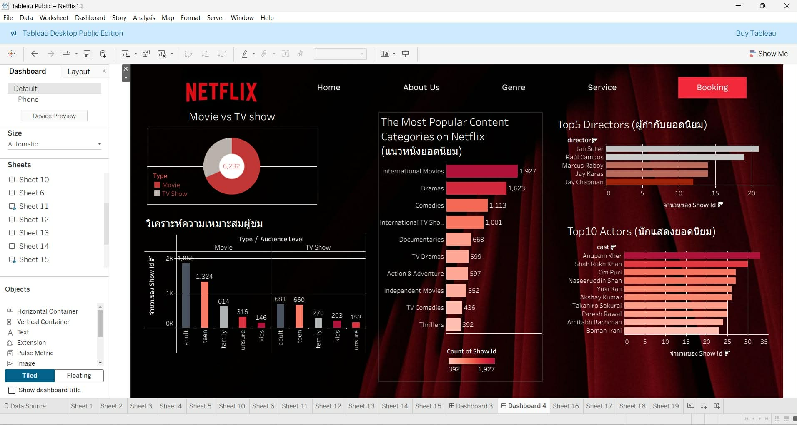

# Netflix Data Visualization Dashboard

## 📊 Overview
This project presents an interactive dashboard analyzing Netflix movies and TV shows dataset. The goal is to explore trends, content distribution, and key patterns using data visualization techniques.

## 🛠 Tools
- Tableau
- Excel

## 🔍 Features
- Genre distribution analysis
- Content rating breakdown
- Country-based content distribution
- Release year trends

## 📈 Key Insights
- Most content is concentrated in a few dominant genres
- TV-MA is the most common rating category
- Content production has increased significantly over time
- The United States contributes the largest share of content

## 🎯 Objective
To explore patterns and trends in Netflix content and present insights through an interactive dashboard.

## 📎 File
- Netflix Data Visualization Dashboard.twbx

## 📸 Dashboard Preview

